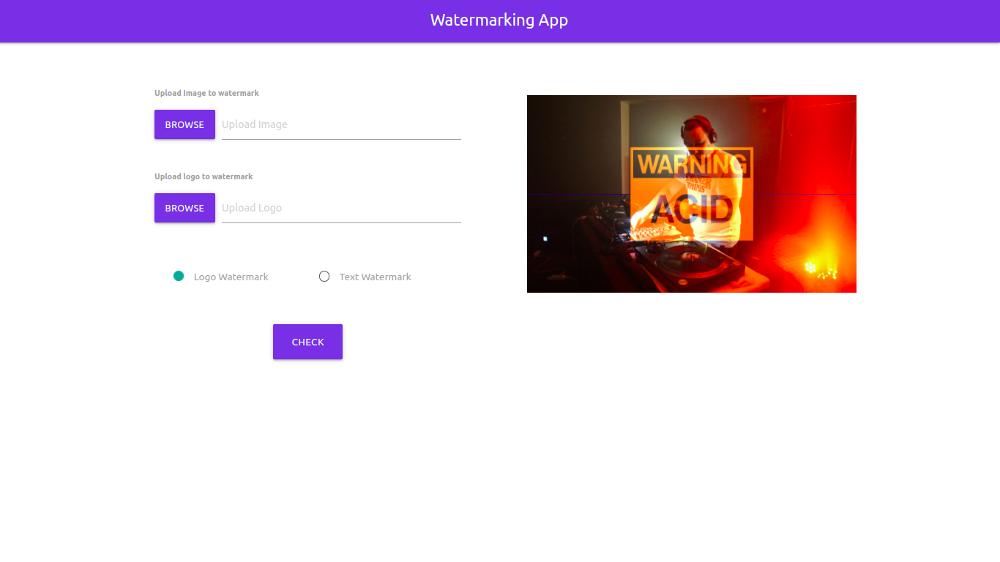

# Image Watermarking With Logo

- Python 3
- Flask
- Cv2
- Numpy
- PIL

---

# Installation on Linux and Unix like OS

- `git clone https://github.com/lenargasimov/image-watermarking.git`
- `cd image-watermarking`
- `python3 -m pip install -r requirements.txt`
- `python3 app.py`

# Instalation on Windows

- `git clone https://github.com/lenargasimov/image-watermarking.git`
- `cd image-watermarking`
- `python -m pip install -r requirements.txt`
- `python app.py`
